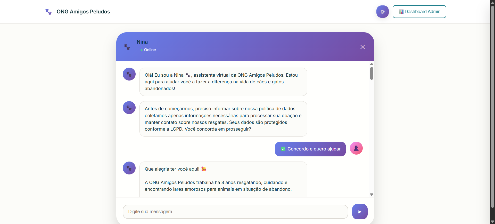
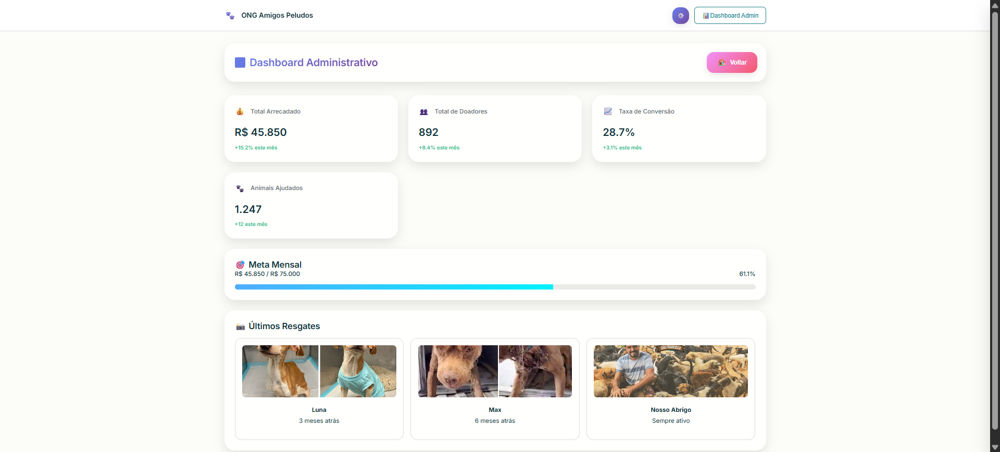
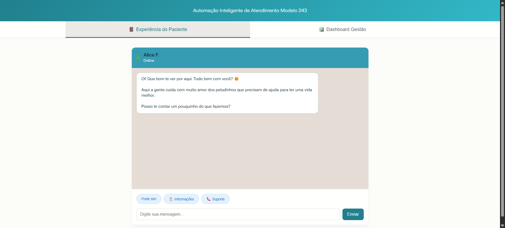
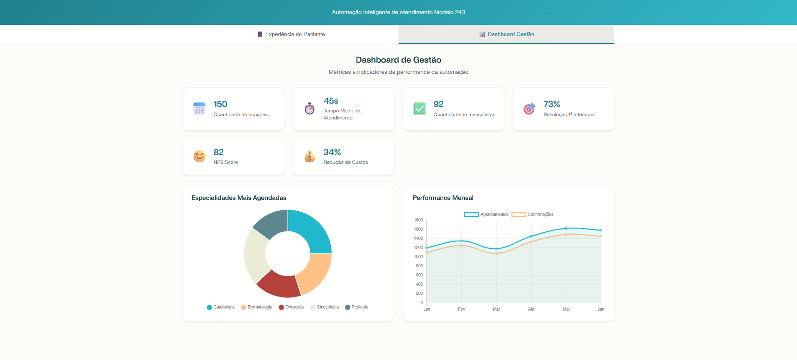

# 🐾 Nina - Chatbot para Doações ONG

Nina é um contato inteligente humanizado desenvolvido para facilitar doações online para ONGs de proteção animal.

📸 Preview

## ✨ Funcionalidades

- Conversa humanizada e empática
- Conformidade com LGPD
- Múltiplas opções de pagamento via PIX
- Interface acessível (multilíngue, modo escuro/claro)
- Galeria de animais resgatados

## 🚀 Como usar

1. Abra o site [`https://contato-inteligenteong.vercel.app/`](https://contato-inteligenteong.vercel.app/) em seu navegador
2. Interaja com Nina através do chat
3. Siga o fluxo de doação personalizado

## 🛠 Tecnologias

- HTML5 + CSS3 + JavaScript
- Design responsivo
- LocalStorage para persistência
- APIs REST

## 📱 Recursos de Acessibilidade

- Suporte a leitores de tela
- Controle de fonte (3 tamanhos)
- Modo escuro/claro
- Multilíngue (PT/EN)

# 📊 Nina Dashboard - Gestão de Doações

Dashboard administrativo para acompanhamento de métricas e gestão de doações da ONG.

📸 Preview

## 📈 Métricas Principais

- Total arrecadado: R$ 45.850
- Número de doadores: 892
- Taxa de conversão: 28,7%
- Funil completo de conversão

## 🎯 Funcionalidades

- Gráficos interativos de performance
- Relatórios temporais
- Gestão de relacionamento com doadores
- Análise demográfica
- Exportação de dados

## 🧠 Origem da Ideia

Este projeto foi desenvolvido durante o **Ideathon da Blip**, com o objetivo de criar uma solução inovadora para facilitar e incentivar **doações para ONGs** por meio de **chatbots integrados** a canais como WhatsApp, utilizando automação, provas sociais e pagamentos via Pix.

## 🖼️ MVP - Preview do Contato Inteligente

## 💡 Funcionalidades

- Captação de doações via Pix, cartão e débito automático
- Provas sociais (vídeos, depoimentos)
- Certificado digital para doadores
- Jornada inteligente (fluxo + IA)
- Integração com API de CRM da ONG

## 💻 Como executar

1. Dentro do site [`https://contato-inteligenteong.vercel.app/`](https://contato-inteligenteong.vercel.app/) clique em Dashboard Admin.
2. Os dados são simulados para demonstração
3. Para produção, conecte às APIs reais
